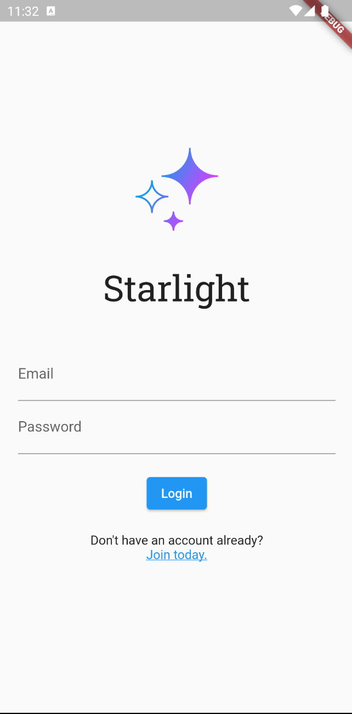

# Starlight

## About

This app created in Flutter is a proof-of-concept demonstrating how Cloud
Firestore can be used to create a payment transactions application.

Firebase is for authentication, and Firestore watch listeners (snapshot
listeners) are used to listen for updates to the relevant user document
as well as transaction documents to facilitate live UI updates.

## Data Schema

### `users` collection
- `balanceCents`: number (int)
- `email`: string
- `lastTxId`: string
- `uid`: string (Firebase auth uid)

### `transactions` collection
- `amountCents`: number (int)
- `fromUid`: string (Firebase auth uid)
- `fromUsername`: string
- `timestamp`: timestamp
- `toUid`: string (Firebase auth uid)
- `toUsername`: string

### Notes
The `users` collection and `transactions` collection are interdependent
for committing balance transfers.

## Technologies Used

- Flutter
- Dart
- Firebase SDK
- Cloud Firestore SDK

## Screenshots

**Home:**

**Transactions:**

**Send Funds:**

**Profile:**

**Register:**

